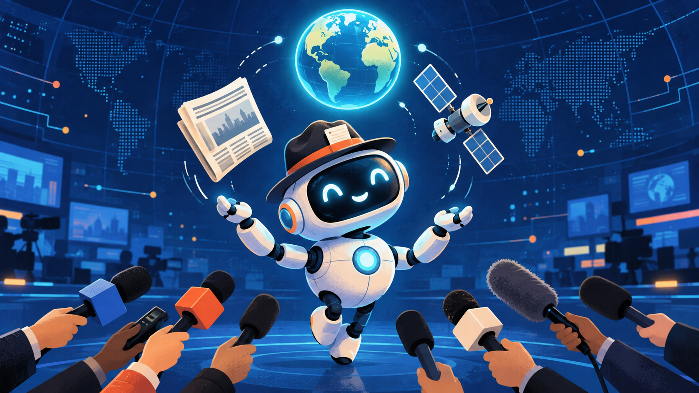

  

  <h1>Current Events</h1>

  
<strong>A student-friendly briefing on global developments and the technology shaping them.</strong>

  
<a href="global_events.md">Explore Global Events</a> · <a href="ai_events.md">Explore AI Events</a>

## Explore the Briefing

| 🌍 Global Events | 🤖 AI Events |
| --- | --- |
| Follow international stories that affect people, trade, security, and everyday life. | Explore frontier AI, cybersecurity, alignment, and responsible technology. |
| [Read Global Events →](global_events.md) | [Read AI Events →](ai_events.md) |

## Featured Topics

- **Global:** [Why the Strait of Hormuz and Bab el-Mandeb matter to oil markets](global_events.md#oil-at-risk-why-the-strait-of-hormuz-and-bab-el-mandeb-matter)
- **AI:** [How Mythos-class frontier models change computer-security concerns](ai_events.md#mythos-and-computer-security-the-double-edged-promise-of-frontier-models)

## About This Project

Each article turns a current news development into a clear summary, visual explainer, and set of direct links to the original reporting or primary sources. The goal is to make complex topics easier to understand while keeping the evidence easy to check.
