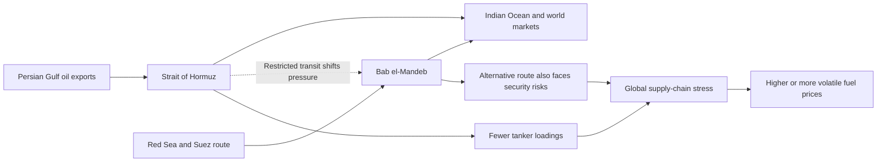

# Global Events

## Oil at Risk: Why the Strait of Hormuz and Bab el-Mandeb Matter

*September 2026*

The Strait of Hormuz is the exit from the Persian Gulf. Bab el-Mandeb links the Red Sea to the Indian Ocean. Both are narrow routes that matter for oil shipping. If one gets blocked or becomes unsafe, pressure moves to the other.

### How Two Chokepoints Create Global Oil Pressure

The International Energy Agency said the Hormuz closure was disrupting supply chains and cutting product availability. It also lowered its 2026 oil-supply forecast. The problem: Bab el-Mandeb is not a simple backup route because it has security risks too.

For people buying gas or plane tickets, this can mean higher or less predictable prices. Oil can be rerouted, but longer routes and pipelines cost more and have limited capacity.

**Sample links:** [International Energy Agency — *Oil Market Report, August 2026*](https://www.iea.org/reports/oil-market-report-august-2026) and [Associated Press — *The Houthi advance in Yemen raises concerns about a key shipping choke point*](https://apnews.com/article/ab2e69eb2959979bae44eb4d45ae637e)
