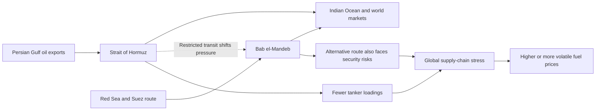

# Global Events

## Oil at Risk: Why the Strait of Hormuz and Bab el-Mandeb Matter

*September 2026*

The Strait of Hormuz and the Bab el-Mandeb are two narrow waterways that connect major oil-producing regions with world markets. Hormuz is the exit from the Persian Gulf; Bab el-Mandeb links the Red Sea to the Gulf of Aden and the Indian Ocean. When shipping through Hormuz is interrupted, exporters may look for other routes, but Bab el-Mandeb has its own security risks. This means that disruption at one chokepoint can increase pressure on the other.

### How Two Chokepoints Create Global Oil Pressure

In its August Oil Market Report, the International Energy Agency (IEA) said the continuing closure of Hormuz was disrupting supply chains and reducing product availability. The agency reported that Gulf oil output and tanker loadings had fallen sharply, and it lowered its 2026 global oil-supply forecast. It also said that an agreement to reopen Hormuz and allow unhindered transit through Bab el-Mandeb remained elusive. Recent reporting from the Associated Press noted that insecurity around Bab el-Mandeb had also weakened a route that Saudi Arabia had used as an alternative when Hormuz shipping was restricted.

For consumers, the effect may appear as higher or more volatile fuel prices. For governments and shipping companies, the problem is larger: oil can sometimes be rerouted through pipelines or around longer sea routes, but those alternatives have limited capacity and can cost more. The situation shows how a conflict near a narrow waterway can have economic effects far beyond the region.

**Original sources:** [International Energy Agency — *Oil Market Report, August 2026*](https://www.iea.org/reports/oil-market-report-august-2026) and [Associated Press — *The Houthi advance in Yemen raises concerns about a key shipping choke point*](https://apnews.com/article/ab2e69eb2959979bae44eb4d45ae637e)
