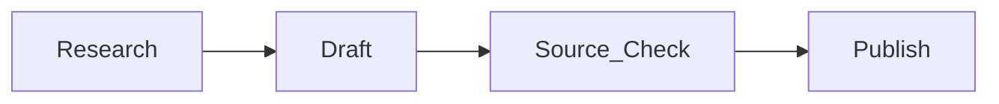

# Markdown & Mermaid

Markdown is a lightweight way to format text without needing a word processor. GitHub automatically renders Markdown files.

## Markdown Basics

```md
# Main heading
## Section heading

This is a paragraph with a [link](https://example.com).


- Bullet item
- Another bullet item

1. First step
2. Second step
```

## Write Useful Alt Text

Alt text should explain the image’s meaning or important content, not just say “image.”

```md

```

## Mermaid Diagrams

Mermaid turns text into diagrams when a viewer supports it, including GitHub.



Keep diagrams small. A good diagram clarifies a relationship that would be harder to understand in a paragraph. The Global Events article uses a chokepoint flow, while the AI article uses a containment stack.
