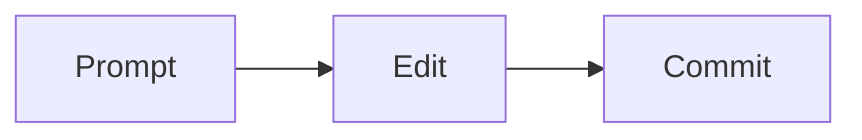

# Markdown & Mermaid

**Where:** open a `.md` file in VS Code's editor. Markdown uses plain text to create headings, links, lists, and images.

This is a complete small page for `global-event.md`. Add the image line during the image commit, after saving the PNG.

````markdown
# Global Events

*September 2026*

This is my global events practice page.
I used AI to draft it and edited it in VS Code.

- Tools: VS Code, AI, and Git

## My workflow




[Back to README](README.md)
````

The diagram renders like this on GitHub:


In `README.md`, link your two pages:

```markdown
- [Global Events](global-event.md)
- [AI Events](ai-event.md)
```

For `ai-event.md`, use its own title and `images/ai-event.png`.

**Check:** open the Command Palette with `Cmd+Shift+P` on Mac or `Ctrl+Shift+P` on Windows. Choose **Markdown: Open Preview to the Side**. You should see formatted headings and links. After pushing, click through the pages on GitHub to check images and Mermaid; your VS Code preview may show Mermaid as code.

Broken image? Match the filename, capitalization, and folder path exactly.
