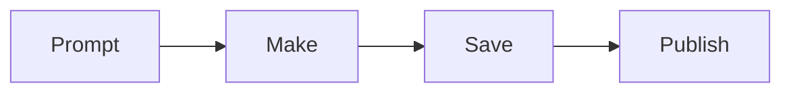

# Markdown & Mermaid

Markdown is fast, plain-text formatting.

```md
# Big title
## Smaller section

[A link](https://example.com)


- Bullet
- Bullet
```

Use Mermaid for a tiny explanation diagram:



Do not make diagrams huge. If a paragraph already explains it, skip the diagram.
